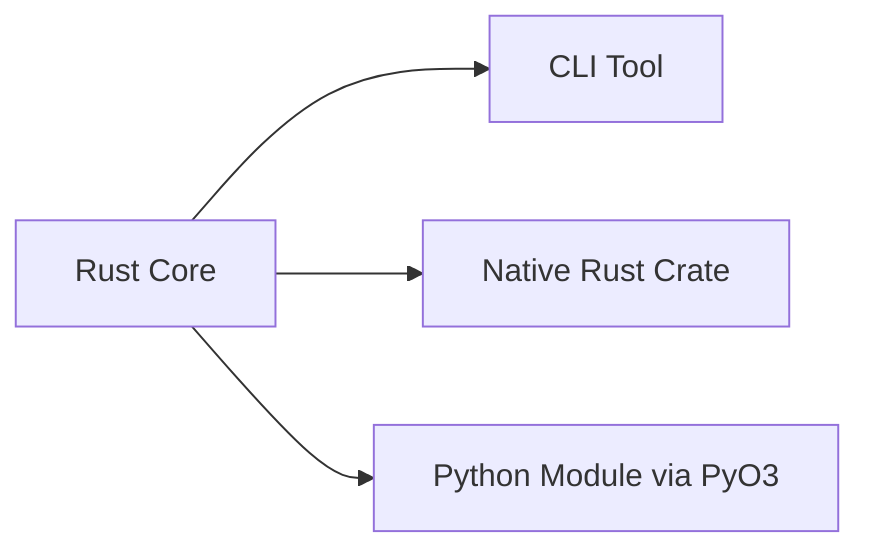

# 🛠️ 2Xsave Organization
**High-performance media research & automation engines powered by Rust**

---

  <a href="#-projects">Projects</a> •
  <a href="#-architecture">Architecture</a> •
  <a href="#-tech-stack">Stack</a> •
  <a href="#-roadmap">Roadmap</a>

## 📖 О нас

**2Xsave** — исследовательская группа, специализирующаяся на глубоком анализе медиаплатформ. Мы превращаем сложные реверс-инжиниринговые задачи в элегантные и быстрые инструменты на Rust.

> [!CAUTION]
> **Disclaimer:** Наши инструменты предназначены исключительно для образовательных целей и личного использования. Мы не поддерживаем пиратство.

---

## 🚀 Projects

Мы упаковываем каждый сервис в отдельное «ядро» (`core`), которое можно использовать как CLI-утилиту или библиотеку.

| Platform | Repository | Status | Engine |
| :--- | :--- | :--- | :--- |
| **TikTok** | [`ttsave_core`](https://github.com/2Xsave/ttsave_core) |  |  |
| **Instagram** | [`insave_core`](https://github.com/2Xsave/insave_core) |  |  |
| **Threads** | [`trsave_core`](https://github.com/2Xsave/trsave_core) |  |  |
| **X (Twitter)** | [`twsave_core`](https://github.com/2Xsave/twsave_core) |  |  |
| **SoundCloud** | [`sksave_core`](https://github.com/2Xsave/sksave_core) |  |  |
| **Common** | [`2xsave_common`](https://github.com/2Xsave/2xsave_common) |  |  |

---

## 🏗 Architecture

Наша экосистема построена на принципе **"Three-Tier Access"**:

* **⚡ Speed:** Нулевая стоимость абстракций.
* **🐍 Versatility:** Используйте мощь Rust в своих Python-скриптах.
* **🛠 Modular:** Общая логика в `2xsave_common` обеспечивает единство API.

---

## 🛠 Tech Stack

Мы используем только самый современный и безопасный инструментарий:

* **Languages:**

* **Async:** [Tokio](https://tokio.rs/) — мощный асинхронный движок.
* **FFI:** [PyO3](https://pyo3.rs/) — бесшовная интеграция Rust в Python.
* **Net:** [Reqwest](https://docs.rs/reqwest) + [Serde](https://serde.rs/) — надежная работа с API и JSON.

---

## 📅 Roadmap

* [ ] **AMSAVE:** Исследование Apple Music API (Web Player).
* [ ] **SPOTIFY:** Начало разработки универсального парсера метаданных.
* [ ] **CLI-UNIFY:** Единая оболочка для управления всеми модулями из одного терминала.
* [ ] **WEB-API:** Опциональный легковесный прокси-сервер для модулей.

---

## 🛡 Non-goals

Мы **НЕ** занимаемся следующими вещами:

1. Обход DRM или систем защиты платного контента.
2. Нарушение приватности пользователей.
3. Создание инструментов для массового спама или деструктивных действий.

---
